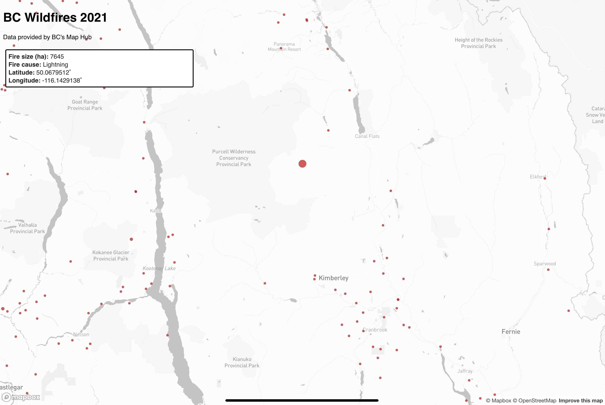

# lab-2

**BC Wildfires 2021**

This image shows the largest wildfire by area at 7645 ha.

https://editor.p5js.org/rstobart/present/fpgA4G7qD

**Resources Used:**

I made use of a few different resources that helped guide me through this assignment. The first of these resources was a map provided to me by Professor Bergman, which was a Mapbox example of getting geoJSON features by hovering over data points. This example helped me understand how to access a geoJSON file and call specific attributes into a dialogue box, however I was not able to figure how to only call specific features forward rather than the entire 'properties' file. I also made use of another mapbox example that allowed me to specify which exact properties I wanted to display in a sidebar on the map. 

**Reflective Analysis:**

My map shows the locations of wildfires in British Columbia in 2021 as a collection of proportional symbols. This map is designed primarily to show the spatial concentration of wildfires near the southern border of Canada, as well as the prevalence of fires directly caused by humans. I believe that my map is ultimately effective in conveying the relevant information, however there are a few additions that would have liked to have made. The first of these additions would be a displayed ratio of human caused fires to those caused by lightning and unknown sources. The second element that I would add is a 'Fire location' section of the sidebar that would show the nearest major town/city to the fire. I experimented with this idea, however I wasn't able to get it to show the relevant data in the sidebar, so I eventually abandoned it.

I began the design process by creating a simple map style in Mapbox.  I chose a largely monochrome map style with bright red data points, which serves to add contrast and highlight the relevant data. I also made the symbols proportional to the size of the fires in **ha**, however much of my data fell into the same size categories and as such my map doesn't show much variation in point sizes. In addition to the data points being red, they are also set at roughly 70% opacity with a darker red outline. This improved the visibility of the data by showing the overlapping sections of the data points. 

